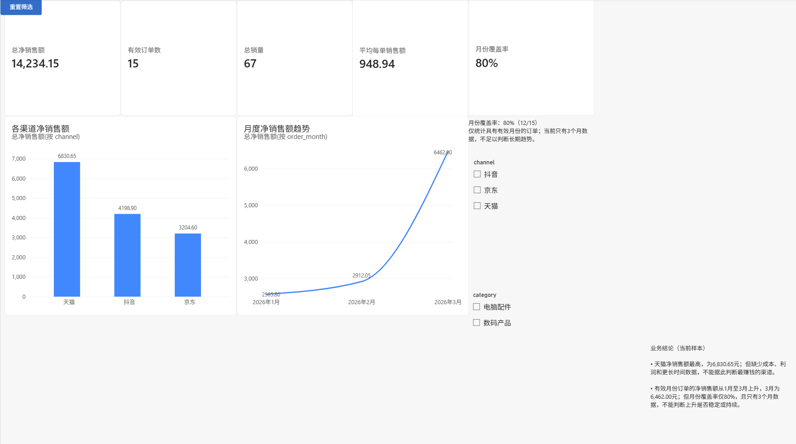

# 第9周：Power BI 销售分析仪表板

## 一、项目目标

本项目使用15笔有效销售订单，在 Power BI 中搭建可交互销售看板，用于查看总体销售规模、渠道贡献、月度变化和月份覆盖情况，并通过 `channel` 与 `category` 切片器按条件交集缩小分析范围。

## 看板预览

## 二、数据来源与范围

- 数据源：`01_python_pandas/outputs/sales_valid_analysis_week3.csv`
- Power BI 数据表：`sales_orders`
- 数据规模：15行、22列
- 数据粒度：每行代表一笔进入正式销售分析范围的有效订单
- 月份覆盖：12笔订单具有有效月份，3笔月份缺失，月份覆盖率为80%

总体销售指标使用全部15笔有效订单；月度折线图只能使用其中12笔具有有效月份的订单。

## 三、核心 KPI 与口径

| KPI | 显式度量值 | 总体结果 | 计算口径 |
|---|---|---:|---|
| 总净销售额 | `[总净销售额]` | 14,234.15元 | 对当前筛选范围内的 `net_sales` 求和 |
| 有效订单数 | `[有效订单数]` | 15笔 | 对当前筛选范围内的 `order_id` 去重计数 |
| 总销量 | `[总销量]` | 67件 | 对当前筛选范围内的 `quantity` 求和 |
| 平均每单销售额 | `[平均每单销售额]` | 948.94元 | 总净销售额 ÷ 有效订单数 |
| 月份覆盖率 | `[月份覆盖率]` | 80% | 有效月份订单数 ÷ 当前订单总数，即12 ÷ 15 |

这些显式度量值可以被多个视觉对象复用。切片器不会修改度量值公式，而是改变度量值当前能够计算的数据范围。

## 四、看板组成与作用

| 视觉对象 | 字段或度量值 | 作用 |
|---|---|---|
| 5张 KPI 卡片 | 5个显式度量值 | 快速查看当前筛选范围的整体销售表现和月份覆盖情况 |
| 渠道柱状图 | `channel`、`[总净销售额]` | 比较不同渠道的净销售额；柱状图适合比较类别数值 |
| 月度折线图 | `order_month`、`[总净销售额]` | 观察具有有效月份订单的时间变化；折线图适合展示按时间顺序的变化 |
| 渠道切片器 | `channel` | 按销售渠道缩小分析范围 |
| 类别切片器 | `category` | 按商品类别缩小分析范围 |
| 重置筛选按钮 | 书签“重置筛选” | 恢复看板保存时的总体筛选状态 |
| 说明与业务结论文本 | 固定说明文字 | 提醒月份覆盖率、样本量和结论适用范围 |

`channel` 与 `category` 切片器按两个条件的交集筛选，所有指标卡和图表会同步更新。需要恢复总体状态时，直接点击“重置筛选”按钮。

## 五、主要结果与业务结论

1. 当前15笔有效订单的总净销售额为14,234.15元，总销量为67件，平均每单销售额为948.94元。
2. 天猫渠道净销售额最高，为6,830.65元；抖音为4,198.90元，京东为3,204.60元。
3. 在12笔具有有效月份的订单中，净销售额从2026年1月的2,565.80元、2月的2,912.05元，变化到3月的6,462.00元，当前样本呈现上升趋势。
4. 月份覆盖率为80%，说明还有3笔有效订单不能进入月度分析。

## 六、分析限制

- 天猫净销售额最高，只能说明它在当前样本中的销售规模最高。
- 由于缺少渠道成本、利润、退款率、获客成本和更长时间数据，不能判断哪个渠道最赚钱或未来表现最好。
- 当前月度图只有3个月数据，而且月份覆盖率只有80%，不能判断上升是否稳定或未来是否会持续。
- 当前数据只有15笔有效订单，结论只能描述当前样本，不能直接推广为长期业务规律。

## 七、使用工具与输出文件

使用工具：

- Power BI Desktop：搭建数据模型和交互式看板
- Power Query：检查字段类型、列质量和数据分布
- DAX：创建可复用的显式度量值
- Markdown：记录指标口径、结论和使用说明

输出文件：

- `sales_dashboard_week9_day1.pbix`：可交互的 Power BI 看板源文件
- `sales_dashboard_week9_overview.png`：看板正式预览图
- `README_week9_day5.md`：项目说明、指标口径和分析结论