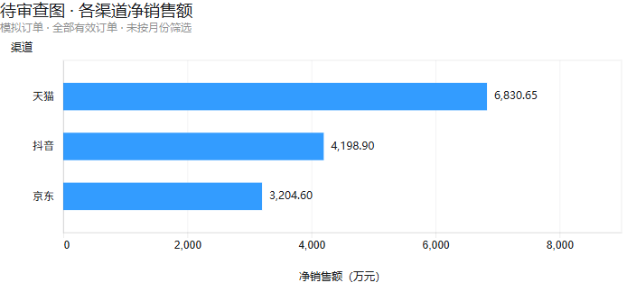
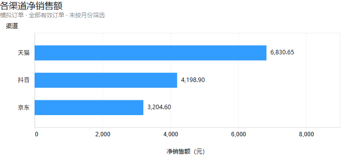

# AI输出审查与验证报告

本报告由教师根据学习者实际作答和运行截图整理。数据为模拟；已有运行结果与本次机械归档检查分别记录。

## SQL：日期为空导致订单漏计

[初稿](../cases/channel_sales/ai_draft.sql)在有效范围内使用`COUNT(order_date)`。学习者指出日期可能为空，在一次范围提醒后补全[明细核对](../cases/channel_sales/missing_dates.sql)，亲自运行发现O1006、O1012（抖音）和O1017（京东）日期为空。

[修正查询](../cases/channel_sales/channel_summary.sql)改用`COUNT(sales_amount_valid)`，保留`WHERE sales_amount_valid = 1`。COUNT计非NULL值的语义由教师补充，不能脱离WHERE认为它只计1。[总体查询](../cases/channel_sales/overall_check.sql)范围相同。

| 渠道 | 净销售额（元） | 有效订单量（笔） |
| --- | ---: | ---: |
| 天猫 | 6830.65 | 7 |
| 抖音 | 4198.90 | 4 |
| 京东 | 3204.60 | 4 |
| 合计 | 14234.15 | 15 |

证据：[空日期明细](../evidence/channel_sql/missing_valid_orders.png)、[渠道汇总](../evidence/channel_sql/channel_summary.png)、[总体核对](../evidence/channel_sql/overall_check.png)。根据NULL明细和COUNT语义可推断初稿漏计3笔；原错误SQL未实际运行，不能称已取得前后两份汇总输出。

## pandas：布尔值与字符串不匹配

[初稿](../cases/channel_sales/ai_draft.py)将bool字段与字符串`"True"`比较，筛选出0行。已提供实际类型后，学习者改为布尔`True`并解释类型差异，亲自运行得到15行。

金额处理和对账使用过概念与局部结构提示：先聚合，再对金额结果列`.round(2)`；渠道合计与总体按同一个指标比较。[最终代码](../cases/channel_sales/channel_review.py)由教师合并已有骨架与学习者修改，得到14234.15元、15笔，两项核对均True，与SQL一致。

证据：[筛选修正](../evidence/channel_pandas/filter_fix_and_channel_summary.png)、[完整对账](../evidence/channel_pandas/channel_overall_reconciliation.png)。本次只调整输入路径；已有骨架与展示包装不计为学习者从空白编写。

## 多表：一对多关联重复累计

[课程初稿](../cases/course_sales/ai_draft.sql)直接将订单与退款明细关联。一单多次退款重复订单行，使实付金额和订单计数被重复累计。初次审查未独立定位；经过概念、小例及完整示范后，学习者提出先按订单聚合退款再JOIN，修正ROUND语法和CTE关联对象，并亲自运行。

[退款聚合](../cases/course_sales/refund_by_order.sql)得到C1001=300元、C1003=600元、C1004=300元、C1006=150元。[类别汇总](../cases/course_sales/category_summary.sql)结果：

| 类别 | 退款后净收入（元） | 已支付订单量（笔） |
| --- | ---: | ---: |
| BI | 2250.00 | 2 |
| Python | 1500.00 | 2 |
| SQL | 900.00 | 2 |
| 合计 | 4650.00 | 6 |

原表基准结构经局部提示后完成并运行：[订单基准](../cases/course_sales/order_baseline.sql)为实付6000元、6笔；[退款基准](../cases/course_sales/refund_baseline.sql)仅统计已支付订单对应退款，共1350元。

| 核对项 | 类别合计 | 原表基准 | 差额 |
| --- | ---: | ---: | ---: |
| 净收入（元） | 2250＋1500＋900＝4650 | 6000－1350＝4650 | 0 |
| 订单量（笔） | 2＋2＋2＝6 | 6 | 0 |

证据：[退款聚合](../evidence/course_sql/refund_by_order_result.png)、[类别结果](../evidence/course_sql/category_summary_result.png)、[原表基准](../evidence/course_sql/original_table_baselines.png)。错误课程SQL未运行，不构造其输出。最后加总数字由教师按学习者授权整理，不额外算作独立解题证据。

## 报告：单位和因果边界

AI初稿称：“抖音与京东均有4笔有效订单，抖音的净销售额高994.30元。这说明抖音的营销策略提升了顾客的消费意愿。”学习者区分了数据支持的差异和无法确定的原因，并指出样本小、模拟数据及其他因素的影响。

审核后表述：本次模拟数据中，抖音与京东均有4笔有效订单，抖音净销售额高994.30元，平均每单净销售额也更高。营销策略、渠道UI等可能影响结果，但当前汇总不能确定原因；小样本和模拟数据限制结论外推。更大的真实观察数据也不能仅凭该比较证明因果效果。

学习者还发现图表将元金额标成“万元”，教师据此修正单位、保留原值。下面两图由教师生成用于审查，不是学习者从空白绘图的证据。

| 含错误的教师初稿 | 单位修正后 |
| --- | --- |
|  |  |

实验仅讨论了方案：年龄信息可获得时按年龄分层后随机分配新旧页面，每组下单转化率＝完成下单的去重访问人数÷该组总去重访问人数。方案有提示，稳定分组由教师补充；未实施A/B实验，未计算显著性或验证页面效果。

## 人工贡献与验证边界

| 工作 | 实际参与 |
| --- | --- |
| 需求和口径 | 学习者确认有效范围、日期缺失纳入、金额与数量及总体核对，教师整理文字 |
| 审查修正 | 学习者识别NULL计数和布尔筛选问题；金额处理、聚合对账和多表结构经过提示修正 |
| 核心运行 | 学习者在自己的终端运行，保存8张结果截图 |
| 退款新情境 | 有辅助完成，最高提示3级、原表核对结构提示2级，不计无辅助独立定位 |
| 图表和报告 | 学习者审核单位和结论边界；教师生成图表、合并报告和既有数字 |
| 输入与包装 | 教师生成课程模拟输入、提供连接展示包装及本次作品整理 |

整体为“能修改验证”，后续在新情境巩固关联粒度和独立核对，不重复抄写已验证数字。不证明从空白独立完成、真实业务收益或AI稳定提高效率。

本次归档核对复制SHA-256、SQL代码抽取、Python路径以外代码一致性、Python语法及本地链接，没有重新执行分析。课程输入清单的`analysis_executed: false`记录最初输入准备时未执行分析，不否定后续用户运行截图。当前交付来源和检查状态见[根清单](../manifest.json)。
